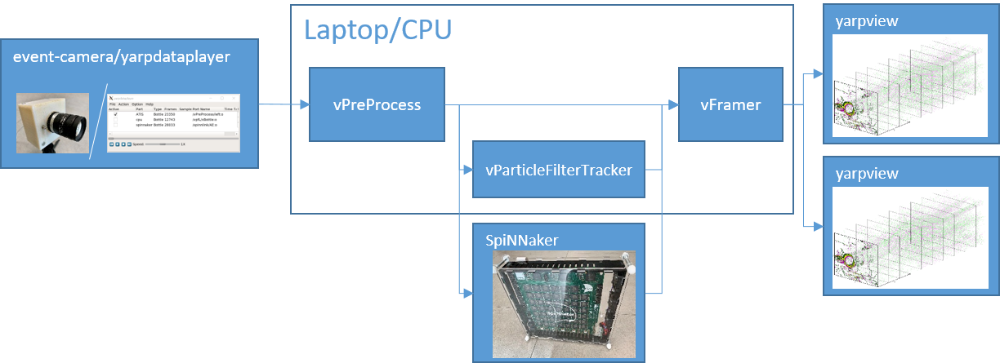

# Event-driven Tracking with a Particle Filter

The algorithm performs tracking of a circle-shaped target given the event-stream from an event-camera. Two hardware implementations are provided:



```
@inproceedings{Glover2017a,
address = {Vancouver, Canada},
author = {Glover, Arren and Bartolozzi, Chiara},
booktitle = {IEEE International Conference on Intelligent Robots and Systems},
pages = {3769--3776},
publisher = {IEEE},
title = {{Robust Visual Tracking with a Freely-moving Event Camera}},
year = {2017}
}
```

## CPU

A C++ YARP module that runs the algorithm on a standard CPU.

#### How to build
1. install [YARP](https://github.com/robotology/yarp)
1. install [event-driven](https://github.com/robotology/event-driven)
1. make sure both YARP and event-driven can be found on the environment path / project path
1. clone this repository (e.g. into `~/projects/particle-filter-tracking`)
1. cd `~/projects/particle-filter-tracking` && mkdir build && cd build
1. cmake ..
1. make
1. ensure the bin is found in the environment path

#### How to run

1. yarpserver --write
1. yarpmanager
1. open the provided yarpmanager application (`particle-filter-tracking/cpu/app_cpu_tracking.xml`)
1. run all
1. open a dataset (example TBA) with the yarpdataplayer
1. connect all
1. play the dataset on the yarpdataplayer

Note: you can substitute the yarpdataplayer with a live feed of an event-camera if it is yarp-compatible. Please contact the authors for more information if you want to make your camera yarp compatible.

## SpiNNaker

Python scripts using the "Graph Front End" of the SpiNNaker tool-chain and c-code for running the algorithm on a SpiNNaker board.

- how to compile and run

### Setting-up SpiNNaker build (ubuntu)

These instructions assume this repository exists at `~/projects/particle-filter-tracking`

1. make directory for SpiNNaker project code  
   `mkdir /home/user/spinnaker && cd /home/user/spinnaker`
1. install cross-compiler from https://developer.arm.com/open-source/gnu-toolchain/gnu-rm/downloads  
   Uncompress in `/home/user/spinnaker`
1. Pull the following repositories from https://github.com/SpiNNakerManchester  
   `DataSpecification`  
   `PACMAN`  
   `spalloc`  
   `SpiNNakerGraphFrontEnd`  
   `spinnaker_tools`  
   `spinn_common`  
   `SpiNNFrontEndCommon`  
   `SpiNNMachine`  
   `SpiNNMan`  
   `SpiNNStorageHandlers`  
   `SpiNNUtils`
1. Set-up your `~/.bashrc` with the following additional lines  
   `export SPINN_DIRS=~/spinnaker/spinnaker_tools`  
   `export PATH=~/spinnaker/gcc-arm-none-eabi-6-2017-q2-update/bin:$SPINN_DIRS/tools:$PATH`  
   `export PERL5LIB=$SPINN_DIRS/tools`  
   `export PYTHONPATH=~/projects/particle-filter-tracking/:$PYTHONPATH`  
   
   `source ~/.bashrc` or restart the terminal  
1. Apply the `bug.patch` to repository `SpiNNFrontEndCommon`  
   `git apply bug.path`  
1. Run the automatic_make.sh script from `/home/user/spinnaker` directory
1. `cd ~/projects/particle-filter-tracking/spinnaker`  
   `make`  
At this point the c-code executables should compile. To use the spinnaker toolchain to build the graph and run the algorithm:

Optional: if you want to use an IDE

1. Set-up Python project using your favourite IDE or install PyCharm and make a new project with the contents of `~/projects/particle-filter-tracking/spinnaker/`
1. Add all the repositories from step 3. as external libraries of the project.

And/otherwise:

1. Follow the steps under "Configuration" here http://spinnakermanchester.github.io/graph_front_end/4.0.0/SpiNNakerGraphFrontEndInstall.html to set-up your SpiNNaker board.
1. `python ~/projects/particle-filter-tracking/spinnaker/pfMain.py`
